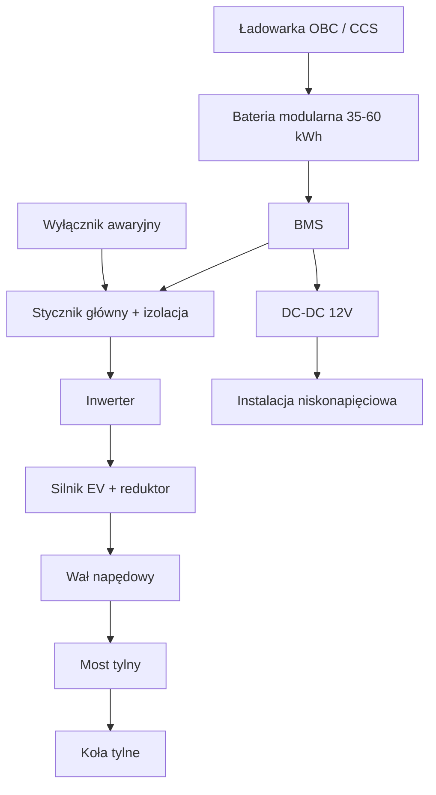

# Rysunki techniczne i diagramy

Ponieważ to repozytorium tekstowe, poniżej znajdują się:
1. Opisy kluczowych rysunków, które powinny powstać w CAD (SolidWorks / Fusion / FreeCAD).
2. Diagramy Mermaid / ASCII do szybkiego zrozumienia architektury.

## Kluczowe rysunki do wykonania (zalecane)

1. **Rysunek montażowy silnika + reduktora w komorze**  
   Widok z boku i z góry, wymiary punktów mocowania, prześwity, trasa wału.

2. **Rozmieszczenie pakietów baterii**  
   Widok podwozia z góry + przekroje. Masa i środek ciężkości przed/po.

3. **Schemat HV**  
   Silnik – inwerter – BMS – gniazdo – styczniki – bezpieczniki. Kolorystyka przewodów.

4. **Schemat LV i integracja deski**  
   12 V, sygnały, CAN, wyświetlacz.

5. **Mocowania crash-safe baterii**  
   Szczegóły połączeń śrubowych / spawanych, strefy kontrolowanego zgniotu.

6. **Porównanie rozkładu masy**  
   Oryginał vs EV (wykres słupkowy lub tabela z procentami).

## Diagram architektury (Mermaid)



## Diagram lokalizacji baterii (ASCII – Caro Plus)

```
Przód (komora silnika)
┌─────────────────────┐
│  Blok baterii A     │  ~15-20 kWh
│  + silnik EV        │
└─────────────────────┘
          │
     [tunel / podłoga]
┌─────────────────────┐
│  Blok baterii B     │  ~15-25 kWh
└─────────────────────┘
          │
Tył (bagażnik / pod podłogą)
┌─────────────────────┐
│  Blok baterii C     │  ~5-15 kWh
└─────────────────────┘
```

## Uwagi do rysunków

Wszystkie rysunki powinny zawierać:
- Tolerancje
- Materiał
- Numerację części zgodną z BOM
- Informację o masie i środku ciężkości
- Oznaczenia bezpieczeństwa HV

Pliki CAD (STEP / STL) można dodać w przyszłości do katalogu `cad/`.
